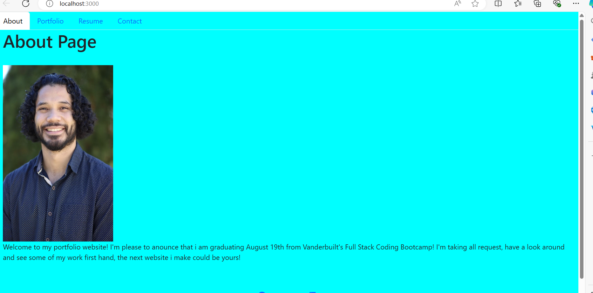

# module-20-portfolio
My react portfolio 
 # The challenge
The Challenge was to create a proffesional portfolio with 6 project examples and different pages with the nav bar linked to them.

# Description
A portfolio for me to use with future job searches.

# What was your motivation?
My motivation for this project was to further expand my coding knowledge.

# Why did you build this project?
For practice to enter the job force in the future with improved coding skills.

# What did you learn?
I learned how to use react and write in jsx files

# Installation
What are the steps required to install your project? Provide a step-by-step description of how to get the development environment running

 npm run dev, click on live host
# Usage 

# screenshot

